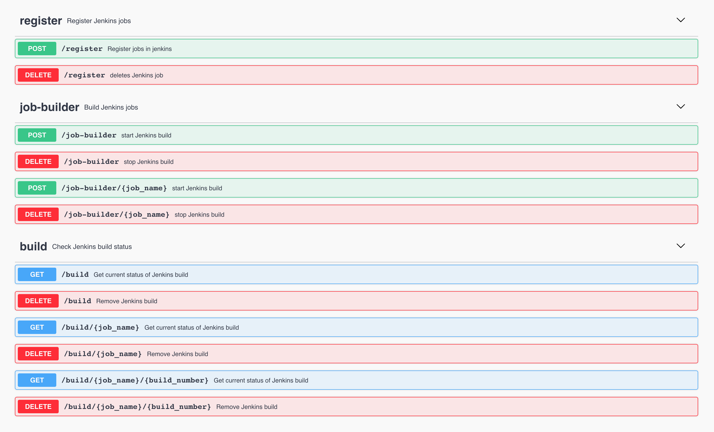

# Otello


## Installation

**NOTE:**
Requires python 3.5+


```bash
$ cd otello/
$ pip install -e .
```


### Initialize

`otello` reads a config file (`~/.config/otello/config.yml`) and loads it into its classes
You can intialize it 1 of 2 ways
* using the CLI tool
    * `$ otello init`
* importing the `otello` library
    * `import otello` and `otello.initialize()`

It will prompt the user to enter the HySDS host and parameters for authentication
```bash
$ otello init
HySDS host (current value: https://###.##.###.###/):
Username (current value: ########):
HySDS cluster authenticated (y/n): n

auth: false
host: https://###.##.###.###/
username: ########
```

For authentication to work properly, AWS Secrets Manager should be set up prior to initializing
otello with authentication. When cluster authentication is set to `y`, it will then ask for
the Secrets Manager ID, which is the ID associated with the stored Secret in Secrets Manager.
If the ID is not specified in the config file, it defaults to the username that was set:
```bash
HySDS cluster authenticated (y/n): y
AWS Secrets Manager ID (current value: ########): 
```

## Continuous Integration (CI)
HySDS uses Jenkins to run continuous integration (CI)
* registering (and un-registering) HySDS jobs
* submitting builds to your HySDS job(s) in Jenkins
* stop/deleting builds

the `CI` class takes a `repo` and `branch` argument in its constructor
```python
from otello import CI
ci = CI(repo="https://github.com/hysds/hello_world_notebook.git", branch="main")
```

the `CI` class methods:

| method | desc | input | return |
| ------ | -----| ----- | ------ |
| `register` | register the HySDS job into Jenkins | |
| `unregister` | remove the job in Jenkins | |
| `check_job_exists` | check if the job is registered in Jenkins |  | `True/False` |
| `submit_build` | submit a build to compile the code into a `docker` image and publishing the job metadata in ElasticSearch |  | `Dict[str, str]` |
| `get_build_status` | get Jenkins build status | `Dict[str, str]` | `build_number<int>` (latest if not supplied) |
| `stop_build` | stop Jenkins build (latest) |  | `Dict[str, str]` |
| `delete_build` | delete build by number | `build_number<int>` | `Dict[str, str]` |

#### CI endpoints
The Mozart Rest API used



## HySDS job management (Mozart)
the `Mozart` class is the entry driver for HySDS management

the `JobType` class represents a singular Hysds job
* allows users to build the proper parameters and inputs
* receive queue(s) and sets a default queue (if given)
* submit a HySDS job

```python
from otello import Mozart
m = Mozart()
```

`Mozart` object methods:

| method | desc | input | return |
| ------ | ---- | ----- | ------ |
| `get_job_types` | return the available list of HySDS jobs |  | `Dict[str, JobType]` |
| `get_job_type` | returns a single `JobType` class instance | `job_type`: `str` | `JobType` |
| `get_jobs` | returns `JobSet` of user submitted jobs | (all optional) `tag`, `job_type`, `queue`, `priority`, `status`, `start_time`, `end_time` | `JobSet` |


`JobType` object methods:

| method | desc | input | return |
| ------ | ---- | ----- | ------ |
| `initialize` | (run this first) retrieve and set the job input parameters and wiring as class attributes | | |
| `get_queues` | retrieve the list of available and recommended queues | | |
| `describe` | prints the basic description and wiring of the Job | | |
| `set_input_params` | prompts the user to set/tune the job parameters manually | | |
| `set_input_dataset` | sets the dataset parameters | `dataset <Dict>` | |
| `get_input_params` | returns the user defined parameters | | `Dict[str, str]` |
| `get_input_dataset` | returns the dataset parameters | | `Dict[str, str]` |
| `submit_job` | submits the Job to HySDS with the tuned parameters | `queue<str:optional>`, `priority<int>`, `tag<str>` | `Job` object

basic flow of `otello`'s job management:
---
**NOTE**

use the [Pele client or Rest API](https://github.com/hysds/pele) to query for datasets stored in the system

---

```python
import otello
m = otello.Mozart()  # initializing the driver

job_name = "job-SCIFLO_GCOV:develop"

# returns the JobType instance representing the specified job
jt = m.get_job_type(job_name)

# print return statement
print(jt)
# HySDS Job: SCIFLO_GCOV (job-SCIFLO_GCOV:NSDS-1128)

# retrieving the Job wiring and parameters
jt.initialize()

# retrieving and setting the job queues
jt.get_queues()

jt.describe()
"""
Job Type: job-SCIFLO_GCOV:NSDS-1128
Label: SCIFLO_GCOV

Tunable Parameters:
	...

Dataset Parameters:
	...
"""

jt.set_input_dataset(dataset)  # dataset returned from the Pele Rest API
jt.set_input_params()

print(jt.params)
"""
ex.
{'dataset_params': {},
 'hardwired_params': {'accountability_class': '#####Accountability',
                      'accountability_module_path': '#####_chimera.accountability',
                      'es_index': 'observation',
                      'module_path': '/home/####/verdi/####/####-pcm',
                      'purpose': 'L0A',
                      'wf_dir': '/home/####/verdi/####/####-pcm/####_chimera/wf_xml'},
 'input_params': {'algorithm_type': 'area-projection',
                      'fullcovariance': 'False',
                      'output_posting': '[20, 100]',
                      'output_type': 'gamma0',
                      'processing_type': 'forward'}}
"""
```

submitting a job will return a HySDS job instance, wrapped in the `Job` class
* the `Job` object will let the user check the current status

`Job` object methods:

| method | desc | input | return |
| ------ | ---- | ----- | ------ |
| `get_status` | get the current submitted job status | | `str` `job-[queued,started,failed,completed]` |
| `get_info` | returns job metadata stored in ElasticSearch | | `Dict[str, str or Dict]` |
| `revoke` | submits a HySDS job to stop the specified job | | `Job` object |
| `remove` | submits a HySDS job to remove/delete the specified job | | `Job` object |
| `retry` | submits a HySDS job to retry current job | | `Job` object |
| `wait_for_completion` | blocking function to wait for job completion (success or failure) | | `str` |
| `get_generated_products` | receives metadata of published products generated from the submitted job | | `Dict[str or Dict]`
| `get_exception` | returns `exception` if job failed | | `str`
| `get_traceback` | returns `traceback` if job failed | | `str`


### Submitting multiple jobs
`otello` provides a dedicated class (`JobSet`) to handle multiple job submissions
* the `JobSet` class takes in a `List` of `Job` class objects in its constructor
* Can use builtin python code:
    * `len(js)`
    * `js.append()`
    * `str(js)`
    * can iterate in `for` loop, ie. `for j in js:`
    * can index or retrieve, ie. `js[0]`

`JobSet` object methods:

| method | desc |
| ------ | ---- |
| `append` | append `Job` object to it's current set of jobs |
| `wait_for_completion` | blocking function to loop through the set of `Job`s, will finish once all jobs are completed/failed |

```python
import otello

m = otello.Mozart()
jt = m.get_job_type("job-SCIFLO_GCOV:develop")
jt.initialize()
# ...
# additional steps to build job parameters

job_set = otello.JobSet()  # creating JobSet to track multiple submitted jobs
for i in range(5):
    # submitting 5 jobs to a JobSet
    j = jt.submit_job(...)
    job_set.append(j)

job_set.wait_for_completion()  # waiting for all 5 jobs to finish
```


## Code Structure
```
. otello
+--- utils
+--- auth
|     +--- (not implemented yet)
+---+ ci (jenkins)
|     +--- register job
|     +--- unregister job
|     +--- build submit
|     +--- build status
|     +--- stop build
|     +--- delete build
+---+ mozart
|     +--- retrieve job(s)
|     +--- submit_job
|     +--- job_status
|     +--- get_job_info
|     +--- get_staged_products
|     +--- delete_job
+---+ datasets
|     +--- (not implemented yet)
|     +--- leverage pele?
```


---
**NOTE**

Any bugs or suggestions can be reported in a GitHub issue

---
